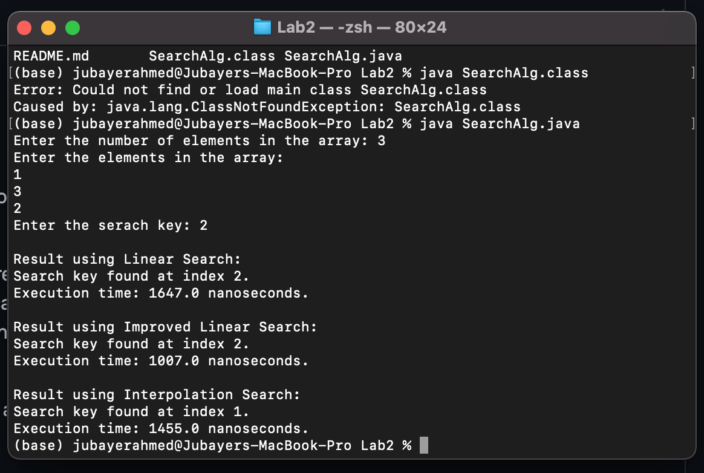
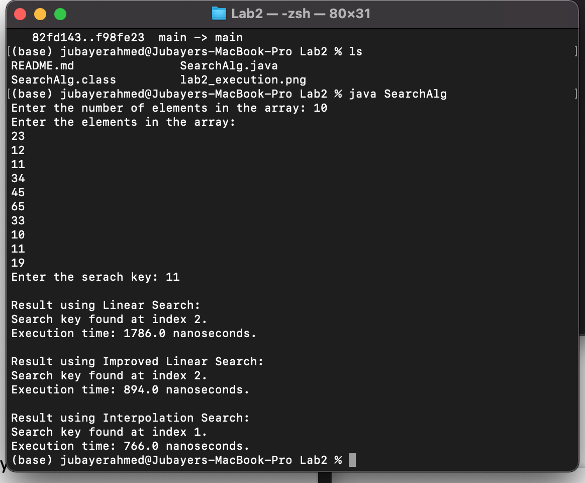

Lab2 Submission
Author - Jubayer Ahmed

Answers to lab2 questions:

Question 1 - See uploaded java file implementing linear and interpolation approach. The code also includes an "improved linear search" approach as requested in Question 3.

Question 2 - The interpolation approach is faster assuming that the array is already sorted. This is because the algorithm does not have to iterate through each element in the array. The algorithm starts to search at a calculated position based on the value of the key relative to the first and last entries in the array. Note that if an array is not sorted, then it might take more time to use this approach as the time required to sort will need to be accounted for.

Question 3 - I improved the linear search algorithm by starting in the midpoint and checking to right and left of this midpoint with each search. This means we could be completing the search up to twice as fast.

Execution:

